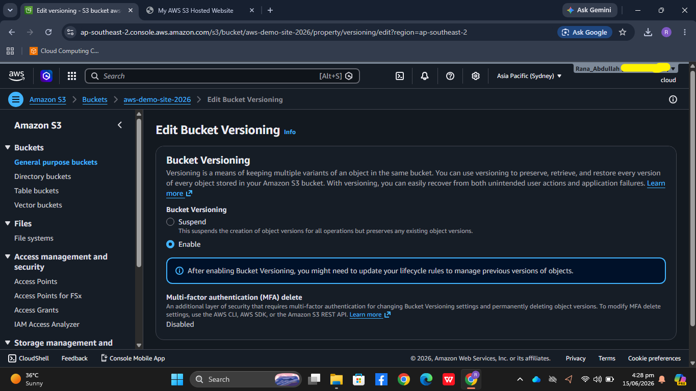
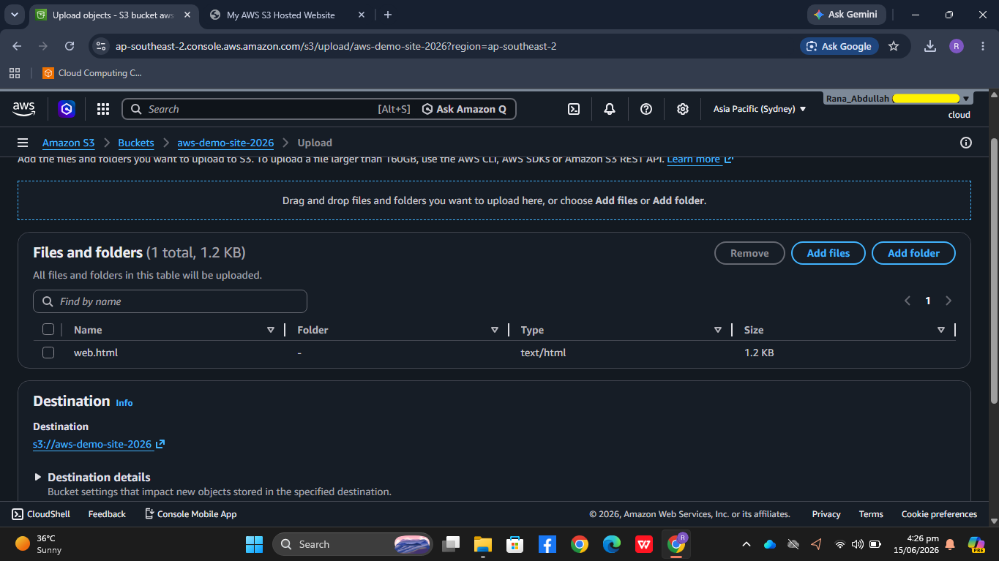

# AWS S3 Static Website Hosting with Bucket Versioning

A practical implementation of hosting a static website on Amazon S3 and enabling Bucket Versioning to safely manage file history and updates.

## 🚀 Workflow & Verification Steps

### 1. Initial Deployment
Hosted the baseline static website using an S3 bucket configured for static website hosting.

### 2. Enabling S3 Bucket Versioning
Enabled **Bucket Versioning** from the AWS Management Console to preserve, retrieve, and restore every version of every object stored in the bucket.

### 3. Uploading Updated Website File
Modified the source code locally and uploaded the updated `web.html` file into the destination bucket.

### 4. Final Live Verification
Verified the live website endpoint. The updated version (V1) is successfully served, while the older baseline version is safely preserved as a historical object variant in the S3 backend.

## 🛠️ Tech Stack
* **Cloud Provider:** Amazon Web Services (AWS)
* **Core Service:** Amazon S3 (Simple Storage Service)
* **Frontend:** HTML5, CSS3
